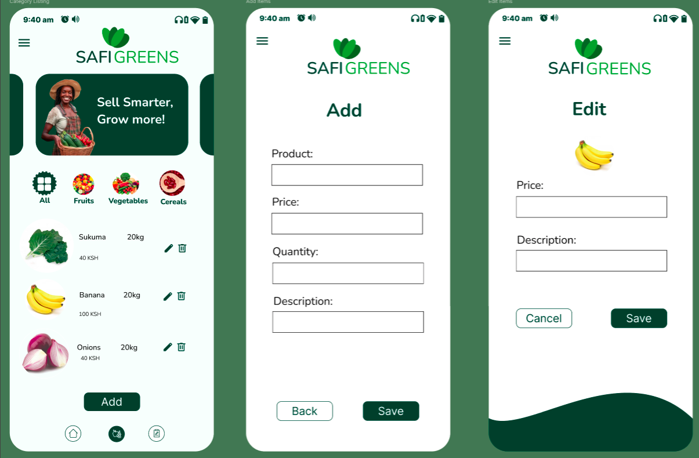
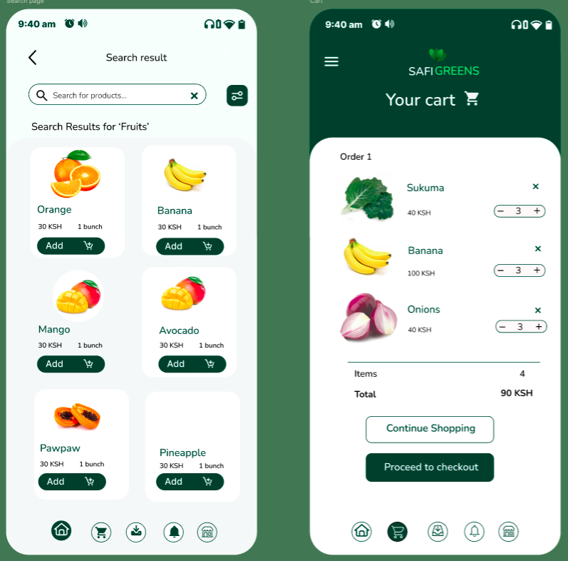
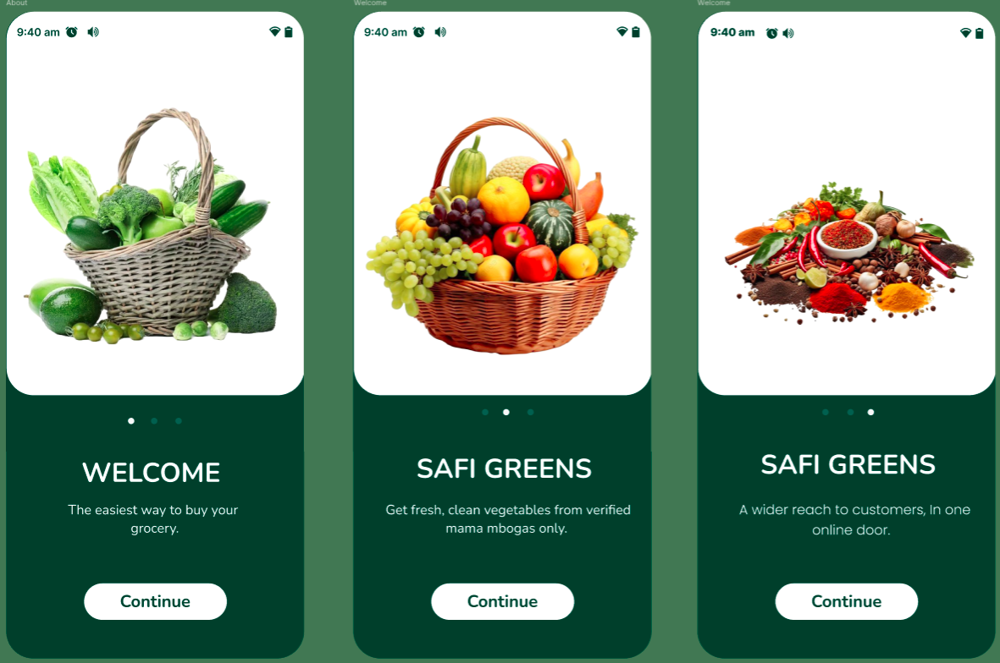

  

# 📖 Safi Greens User Guide

Welcome to Safi Greens!  
This guide will help Mama Mboga vendors and customers get the most out of our platform.

---

## 🧑‍🌾 For Mama Mboga Vendors

### 1. Register Your Shop

- Click **Sign Up** and fill in your name and phone number.
- Choose a password and confirm registration.
- Add your shop details (location, produce type).

### 2. List Your Fresh Produce

- Go to “My Products” in your dashboard.
- Click **Add New Item**.
- Upload a photo (or choose from sample images).
- Enter the name, price, and quantity.

  

### 3. Manage Orders

- View incoming orders in “My Orders.”
- Accept and prepare orders for delivery.
- Mark orders as completed when done.

### 4. Get Paid

- Receive payments securely via MPesa.
- Track your earnings in the dashboard.

### 5. Tips & Support

- Use the Advisor for tips on fresh storage and reducing spoilage.
- Contact support anytime for help.

---

## 🛒 For Customers

### 1. Sign Up and Browse

- Create an account using your phone number.
- Browse fresh vegetables and fruits from local Mama Mboga vendors.

### 2. Place an Order

- Add items to your cart.
- Choose delivery or pick-up.
- Confirm your order and pay with MPesa.

  

### 3. Track Your Order

- Get updates on your order status.
- View past orders and reorder easily.

### 4. Enjoy Fast Delivery

- Your fresh groceries will be delivered quickly and safely to your door.

### 5. Rate & Review

- Rate your experience to help Mama Mboga vendors improve.
- Leave a review for your favorite vendors!

---

## 💡 Tips for Success

- Check for daily specials and discounts.
- Use the Advisor for tips on keeping produce fresh.
- Invite friends and family to enjoy Safi Greens!

---

## 📞 Need Help?

If you have any questions,  
Email us at [support@safigreens.com](mailto:support@safigreens.com) or use the in-app help button.

---

  

---

**Thank you for making your community healthier and greener!** 🥬🍅🥕
