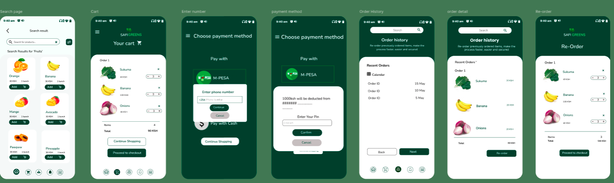

# Safi Greens Mama Mboga Advisor – User Guide

Welcome to the Safi Greens platform! This guide helps both Mama Mboga vendors and customers get started, use, and make the most of the Mama Mboga Advisor AI Agent and our Progressive Web App.

## Table of Contents

- [Introduction](#introduction)
- [Who Is This Guide For?](#who-is-this-guide-for)
- [Getting Started](#getting-started)
  - [For Mama Mbogas](#for-mama-mbogas)
  - [For Customers](#for-customers)
- [Main Features](#main-features)
- [Mama Mboga Advisor AI Agent](#mama-mboga-advisor-ai-agent)
- [Step-by-Step Tasks](#step-by-step-tasks)
  - [Sign Up & Log In](#sign-up--log-in)
  - [List Produce](#list-produce)
  - [Place an Order](#place-an-order)
  - [Use MPesa Payments](#use-mpesa-payments)
  - [Track Orders](#track-orders)
- [Shelf Life, Storage & Spoilage Tips](#shelf-life-storage--spoilage-tips)
- [Smart Shopping & Savings](#smart-shopping--savings)
- [FAQ](#faq)
- [Contact & Help](#contact--help)
- [Troubleshooting](#troubleshooting)
- [Feedback](#feedback)
- [Visuals & Resources](#visuals--resources)
- [Version & Updates](#version--updates)

---

## Introduction

Safi Greens is a digital solution that empowers local vegetable vendors (Mama Mboga) and their customers with a simple, safe, and smart shopping experience. Our platform connects urban buyers with fresh produce sellers, featuring:

- Easy-to-use Progressive Web App
- Integrated MPesa payments
- Last-mile delivery
- AI-powered advice for smarter shopping and less food waste

---

## Who Is This Guide For?

- **Mama Mboga Vendors:** Women selling vegetables at kiosks, looking for a digital platform to grow their business.
- **Customers:** Anyone who wants to buy fresh produce online, save time, and enjoy convenient delivery.

---

## Getting Started

### For Mama Mbogas

1. **Sign Up:** Register with your phone number.
2. **List Your Produce:** Add what you have in stock, set prices, and update availability.
3. **Receive Orders:** Get notified when customers place orders.
4. **Manage Orders:** Prepare and confirm delivery.
5. **Get Paid via MPesa:** Simple, secure payments.

### For Customers

1. **Browse Fresh Produce:** See what’s available from local Mama Mbogas.
2. **Add to Cart & Order:** Select items, choose delivery, and pay via MPesa.
3. **Track Orders:** Get updates from shop to delivery.
4. **Rate Your Experience:** Help Mama Mbogas improve!

---

## Main Features

- **Product Listing:** Vendors add and update available produce.
- **Order Management:** Track, accept, and fulfill customer orders.
- **MPesa Integration:** Safe payments for all users.
- **AI Agent Advisor:** Get tips on storage, shelf life, and savings.
- **Last-mile Delivery:** Affordable delivery to your home or business.

---

## Mama Mboga Advisor AI Agent

The AI Agent is your smart assistant for:

- Shelf life guidance (how long your produce stays fresh)
- Storage tips (best ways to keep food safe)
- Spoilage detection (spot when produce is past its prime)
- Smart shopping (save money, reduce waste)

**How to use:**

- Access the AI Agent from the app dashboard.
- Ask about any fruit or vegetable.
- Get instant advice tailored to your needs.

---

## Step-by-Step Tasks

### Sign Up & Log In

1. Open the Safi Greens web app: [Launch Demo App](https://appetize.io/app/b_7yvxlmavg5xbltovvc5hm6k7ja?device=pixel7&osVersion=13.0&toolbar=true)
2. Click “Sign Up” and enter your phone number.
3. Enter the code sent to your phone.
4. Set up your profile (name, kiosk location for vendors).

### List Produce

- Go to “My Products” → “Add New Item”
- Fill in name, price, available quantity
- Optionally upload a photo

### Place an Order

- Customers browse items
- Click “Add to Cart”
- Review cart and checkout

### Use MPesa Payments

- At checkout, select “Pay with MPesa”
- Enter your phone number
- Confirm payment

### Track Orders

- Vendors: See new and processing orders under “Orders”
- Customers: Track delivery status in “My Orders”

---

## Shelf Life, Storage & Spoilage Tips

- AI Agent gives custom advice on shelf life for each item
- Best storage practices are shown for every product
- Spoilage detection tips and visuals included

---

## Smart Shopping & Savings

- Get suggestions on how to minimize waste
- Tips for planning weekly purchases
- Alerts for items nearing their expiry

---

## FAQ

- [How do I sign up?](#sign-up--log-in)
- [How does MPesa work on Safi Greens?](#use-mpesa-payments)
- [Can I change my order?](#track-orders)
- [What should I do if produce is spoiled?](#shelf-life-storage--spoilage-tips)
- [How do I contact support?](#contact--help)

---

## Contact & Help

- For technical help: [support@safigreens.com](mailto:support@safigreens.com)
- For business inquiries: [business@safigreens.com](mailto:business@safigreens.com)
- In-app help: Click “Help” on the dashboard

---

## Troubleshooting

- **Cannot log in?** Check your phone number and resubmit.
- **Payment issues?** Make sure MPesa is active and funds are available.
- **Order not delivered?** Contact vendor or use in-app support.

---

## Feedback

- Rate your experience after each order.
- Suggest new features via the “Feedback” button in the app.

---

## Visuals & Resources

- [System Architecture Diagram (Lucidchart)](https://lucid.app/lucidchart/7263de22-187a-420f-a047-80f08c20bb45/edit?referringApp=slack&invitationId=inv_64dcd694-e37b-43ba-a2c7-c936a39d5e59&page=0_0#)
- [Brand Designs (Figma)](https://www.figma.com/design/neV9t33HSy5WE2IHlVgwNH/Big_Minds-Design?node-id=424-128&p=f&t=IB79oess1v2oQCRu-0)
- [Admin dashboard (Figma)](https://www.figma.com/design/aS7x1NNWoTxKNRX7Oj2K0G/Admin-Safi?node-id=0-1&p=f&t=rEuVmzaAGaTkMwlM-0)
- 
- 

---

## Version & Updates

- This documentation is for Version 1.0 (July 2025)
- See [Release Notes](RELEASE_NOTES.md) for updates and changes.

---

**Let’s keep Mama Mbogas thriving and customers happy—digitally!**
